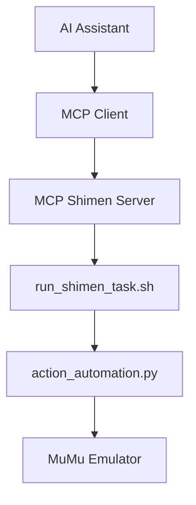

# MCP 师门任务 (Shimen Task) Automation Tool Design

## Executive Summary

This document outlines the design for transforming the existing 师门任务 (Shimen Task) game automation project into a simple Model Context Protocol (MCP) tool. The goal is to create a single, AI-controllable tool that can execute the entire automation sequence through any MCP-compatible AI assistant.

## Table of Contents

1. [Current State Analysis](#current-state-analysis)
2. [Simplified MCP Architecture](#simplified-mcp-architecture)
3. [Single Tool Definition](#single-tool-definition)
4. [Implementation Plan](#implementation-plan)
5. [Benefits](#benefits)

## Current State Analysis

### Existing Implementation
The current project implements a macOS-based game automation system with:

- **Action-based automation engine** (`action_automation.py`)
- **Template matching** for UI element detection
- **LaunchAgent scheduling** for daily execution
- **Avatar detection and keyword analysis** using AI vision models
- **Configuration-driven action plans** (`config.py`)
- **Robust permission handling** for macOS screen recording and accessibility

### Key Strengths
- ✅ **Proven reliability**: Successfully automates complex game sequences
- ✅ **macOS native integration**: Proper permission handling and scheduling
- ✅ **Template-based UI detection**: Resilient to minor UI changes
- ✅ **AI-powered text analysis**: GPT-4o vision for Chinese text recognition
- ✅ **Modular design**: Clear separation of concerns

### Current Limitations
- ❌ **No AI integration**: Cannot be controlled by AI assistants
- ❌ **Only scheduled execution**: No on-demand automation
- ❌ **Manual operation**: Requires shell script execution

## Simplified MCP Architecture

### Overview
Create a minimal MCP server with a single tool that wraps the existing automation script, making it callable by any MCP-compatible AI assistant.



### Core Components

#### 1. MCP Server (`server.py`)
- **Simple FastMCP server** (from official `mcp` SDK) with one tool registration
- **Direct shell script execution** using existing `run_shimen_task.sh`
- **Basic error handling and logging**

#### 2. Existing Scripts (No Changes Required)
- **Keep current `run_shimen_task.sh`** exactly as is
- **Keep current `action_automation.py`** exactly as is
- **Keep current `config.py`** exactly as is

## Single Tool Definition

### `run_shimen_task`
**Purpose**: Execute the complete 师门任务 automation sequence using the existing shell script

```typescript
interface RunShimenTaskArgs {
  verbose?: boolean;            // Default: false - show detailed output
}

interface RunShimenTaskResult {
  success: boolean;
  output: string;               // Complete shell script output
  execution_time_seconds: number;
  error_message?: string;
}
```

**Implementation**: 
- Simply calls the existing `run_shimen_task.sh` script
- Captures all output and returns it
- Reports success/failure based on script exit code
- No changes needed to existing automation code

## Implementation Plan

### Single Phase Implementation (1-2 Days)

1. **Create MCP Server Structure**
   - Create `mcp_game_automation_server/server.py`
   - Install MCP dependency: `pip install "mcp[cli]"`
   - Register one tool: `run_shimen_task`

2. **Implement Simple Tool**
   ```python
   from mcp.server.fastmcp import FastMCP
   
   mcp = FastMCP("Shimen Task Automation")
   
   @mcp.tool()
   def run_shimen_task(verbose: bool = False) -> dict:
       """Execute the 师门任务 automation sequence"""
       # Call existing run_shimen_task.sh script
       # Return results
   ```

3. **Test Integration**
   - Start MCP server
   - Connect with MCP client (Claude Desktop, etc.)
   - Test automation execution through AI assistant

### File Structure
```
mcp_game_automation_server/
├── server.py              # Single MCP server file
└── requirements.txt       # Just mcp[cli] dependency

# Existing files remain unchanged:
├── run_shimen_task.sh     # Keep as-is
├── action_automation.py   # Keep as-is  
├── config.py             # Keep as-is
└── game_elements/        # Keep as-is
```

## Benefits

- ✅ **AI Control**: AI assistants can run automation on command
- ✅ **Minimal Changes**: Existing scripts remain untouched
- ✅ **Quick Implementation**: Can be built in 1-2 days
- ✅ **No Complexity**: Simple wrapper around existing functionality
- ✅ **Instant Value**: Immediate AI integration without rewriting code

## Example Usage

```
User: "Run my 师门任务 automation"
AI: [Calls run_shimen_task tool]
Result: "✅ 师门任务 automation completed successfully in 45 seconds"
```

The simplest possible MCP integration that provides immediate AI control over the existing automation system. 