# Game Automation Project

Automated gameplay tools for Chinese mobile games using Python, OpenCV, and AI-powered text analysis with macOS LaunchAgent scheduling.

## 🎯 Overview

This project automates the **师门任务 (Shimen Task)** in mobile games running on MuMu emulator. The automation includes:
- **Daily scheduling** using macOS LaunchAgent
- **Template-based UI detection** for reliable clicking
- **Screen capture with permission handling**
- **Multi-step automation workflows**

## 🚀 Features

### Core Automation
- **LaunchAgent scheduling**: Native macOS daily task automation
- **Template matching**: PNG-based UI element detection using OpenCV
- **Emulator integration**: Seamless MuMu emulator control
- **Permission handling**: Proper screen recording and accessibility permissions

### Avatar Detection & Keyword Analysis
- **Avatar template matching**: Detect specific player avatars in chat
- **AI-powered text extraction**: GPT-4o vision model for Chinese text recognition
- **Intelligent keyword detection**: Context-aware keyword analysis
- **Automated avatar clicking**: Click avatars based on message content

### Smart Coordinate Handling
- **Retina display support**: Automatic scaling between logical and physical coordinates
- **Multiple click strategies**: Center, edge, and custom positioning options
- **Visual debugging**: Debug images with bounding boxes and confidence scores

## 📋 How the Process Works

### 1. **LaunchAgent Scheduling (macOS Native)**

The automation uses macOS LaunchAgent instead of cron for better permission handling:

**LaunchAgent File:** `~/Library/LaunchAgents/com.user.shimen.task.plist`
```xml
<key>StartCalendarInterval</key>
<dict>
    <key>Hour</key>
    <integer>17</integer>
    <key>Minute</key>
    <integer>32</integer>
</dict>
```

**Why LaunchAgent > Cron:**
- ✅ **User context**: Runs with proper GUI permissions
- ✅ **Screen recording**: Inherits user's screen recording permissions
- ✅ **Native macOS**: Better integration with system security
- ✅ **Reliable**: No permission denied errors

### 2. **Automation Workflow (师门任务)**

```mermaid
graph TD
    A[LaunchAgent Triggers] --> B[Open MuMu Emulator]
    B --> C[Wait for Interface]
    C --> D[Template Match: Play Button]
    D --> E[Click Play Button]
    E --> F[Wait for Boot]
    F --> G[Template Match: Start Game]
    G --> H[Click Start Game]
    H --> I[Wait for Game Load]
    I --> J[Template Match: Login]
    J --> K[Click Login]
    K --> L[Template Match: 师门任务]
    L --> M[Click 师门任务]
    M --> N[Template Match: Go Finish]
    N --> O[Click Go Finish]
    O --> P[Complete ✅]
```



### 3. **Template Matching Process**

1. **Screen Capture**: Take screenshot with proper permissions
2. **Scaling Detection**: Handle Retina display (2x scaling)
3. **Template Matching**: Use OpenCV to find UI elements
4. **Confidence Check**: Ensure match confidence > threshold
5. **Coordinate Calculation**: Convert to logical coordinates for clicking

### 4. **Permission Architecture**

**Required macOS Permissions:**
- 🔐 **Screen Recording**: For taking screenshots
- 🔐 **Accessibility**: For controlling other applications
- 🔐 **Full Disk Access**: For comprehensive system access

**Permission Context:**
```
User Login Session
├── LaunchAgent (inherits user permissions)
├── Terminal.app (granted screen recording)
├── Python script (runs in user context)
└── PyAutoGUI (works with proper permissions)
```

## 🔧 Installation & Setup

### 1. **Clone and Install Dependencies**
```bash
git clone <repository-url>
cd game_automation_project
python -m venv venv
source venv/bin/activate
pip install -r requirements.txt
```

### 2. **Grant macOS Permissions**

**System Settings → Privacy & Security:**

1. **Screen Recording**:
   - Add `Terminal.app`
   - Check the checkbox ✅

2. **Accessibility**:
   - Add `Terminal.app`
   - Check the checkbox ✅

3. **Full Disk Access**:
   - Add `Terminal.app`
   - Check the checkbox ✅

**⚠️ Important: Restart Terminal after granting permissions!**

### 3. **Set Up LaunchAgent**

The LaunchAgent is automatically created at:
`~/Library/LaunchAgents/com.user.shimen.task.plist`

**Load the LaunchAgent:**
```bash
launchctl load ~/Library/LaunchAgents/com.user.shimen.task.plist
```

**Verify it's running:**
```bash
launchctl list | grep shimen
```

### 4. **Configure Schedule**

Edit the plist file to change timing:
```xml
<key>StartCalendarInterval</key>
<dict>
    <key>Hour</key>
    <integer>9</integer>    <!-- 9 AM -->
    <key>Minute</key>
    <integer>30</integer>   <!-- 30 minutes -->
</dict>
```

**Reload after changes:**
```bash
launchctl unload ~/Library/LaunchAgents/com.user.shimen.task.plist
launchctl load ~/Library/LaunchAgents/com.user.shimen.task.plist
```

## 📊 Monitoring & Logs

### **Log Files**
- `shimen_task.log`: Main automation execution log
- `launchd_output.log`: LaunchAgent stdout
- `launchd_error.log`: LaunchAgent stderr

### **Real-time Monitoring**
```bash
# Watch automation logs
tail -f shimen_task.log

# Watch LaunchAgent logs
tail -f launchd_output.log
```

### **Debug Template Matching**
Debug images saved to: `debug/avatar_template/`
- Screenshots with detection overlays
- Confidence scores and bounding boxes
- Template matching results

## 🔧 Configuration

### **Action Plans** (config.py)
```python
ACTION_PLANS = {
    '师门任务': [
        {'action': 'open_app', 'app': 'mumu'},
        {'action': 'click', 'coordinate': 'play_button'},
        {'action': 'wait', 'duration': 10},
        # ... more steps
    ]
}
```

### **Template Coordinates**
```python
COORDINATES = {
    'play_button': 'game_elements/play_button.png',
    'start_game': 'game_elements/start_game.png',
    'login_button': 'game_elements/login_button.png',
    # ... more templates
}
```

## 🚨 Troubleshooting

### **Common Issues**

**1. Permission Denied Errors**
```
❌ Error: [Errno 2] No such file or directory: 'screencapture'
```
**Solution:** Grant Screen Recording permission to Terminal.app and restart Terminal

**2. Template Not Found**
```
❌ Icon not found. Best confidence: 0.434 (threshold: 0.800)
```
**Solutions:**
- Lower confidence threshold in config
- Update template image
- Check if UI changed

**3. LaunchAgent Not Running**
```bash
# Check if loaded
launchctl list | grep shimen

# Reload if needed
launchctl unload ~/Library/LaunchAgents/com.user.shimen.task.plist
launchctl load ~/Library/LaunchAgents/com.user.shimen.task.plist
```

### **Permission Verification**
```bash
# Test screenshot capability
screencapture test.png && echo "✅ Permissions working" || echo "❌ Permission denied"

# Test automation manually
./run_shimen_task.sh
```

### **Debug Mode**
```bash
# Run with verbose output
python action_automation.py 师门任务 --verbose

# Check template matching
python avatar_message_block_detection.py --all-templates
```

## 📅 Schedule Management

### **Change Daily Schedule**
```bash
# Edit the plist file
nano ~/Library/LaunchAgents/com.user.shimen.task.plist

# Reload LaunchAgent
launchctl unload ~/Library/LaunchAgents/com.user.shimen.task.plist
launchctl load ~/Library/LaunchAgents/com.user.shimen.task.plist
```

### **Disable Automation**
```bash
# Unload LaunchAgent
launchctl unload ~/Library/LaunchAgents/com.user.shimen.task.plist
```

### **Enable Automation**
```bash
# Load LaunchAgent
launchctl load ~/Library/LaunchAgents/com.user.shimen.task.plist
```

## 🔄 Alternative Approaches

### **Direct Coordinates (Fallback)**
If template matching fails, use `config_no_templates.py`:
- Uses hardcoded coordinates instead of templates
- Bypasses screen recording requirements
- Less reliable but permission-free

### **Manual Execution**
```bash
# Run automation manually
./run_shimen_task.sh

# Run specific action plan
python action_automation.py 师门任务
```

## 📁 Project Structure

```
game_automation_project/
├── action_automation.py              # Main automation engine
├── avatar_message_block_detection.py # Avatar template matching
├── config.py                         # Action plans and coordinates
├── run_shimen_task.sh               # LaunchAgent execution script
├── config_no_templates.py           # Direct coordinate fallback
├── game_elements/                   # UI template images
│   ├── avatar/                      # Avatar templates
│   └── *.png                        # Button templates
├── debug/                           # Debug output
└── ~/Library/LaunchAgents/          # LaunchAgent plist (system location)
    └── com.user.shimen.task.plist
```

## 🎯 Success Criteria

**Automation is working properly when you see:**
```
✅ Step 1/10: Open MuMu emulator
✅ Step 2/10: Click emulator play button  
✅ Step 3/10: Wait for emulator to boot
✅ Step 4/10: Click game start button
... (continues through all 10 steps)
✅ 师门任务 automation completed successfully
```

## 📞 Support

**Log Analysis:**
1. Check `shimen_task.log` for automation steps
2. Check `launchd_error.log` for LaunchAgent issues
3. Check `debug/` folder for template matching images

**Common Success Indicators:**
- LaunchAgent loads without errors
- Screenshots work in Terminal
- Template matching finds UI elements
- All 10 automation steps complete

**Key Files:**
- **LaunchAgent**: `~/Library/LaunchAgents/com.user.shimen.task.plist`
- **Main Script**: `run_shimen_task.sh`
- **Logs**: `shimen_task.log`, `launchd_*.log`
- **Config**: `config.py`

This automation system provides reliable, scheduled execution of mobile game tasks using native macOS scheduling and proper permission handling. 